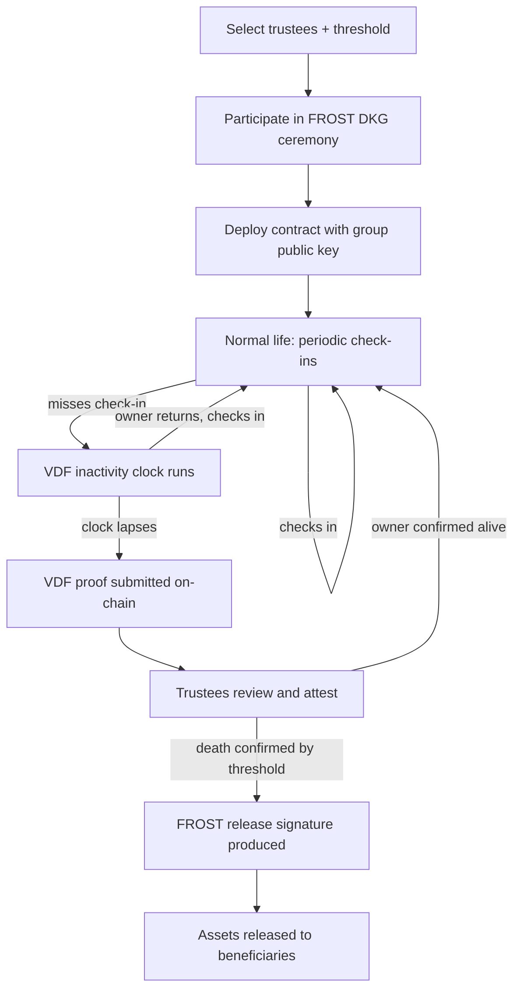
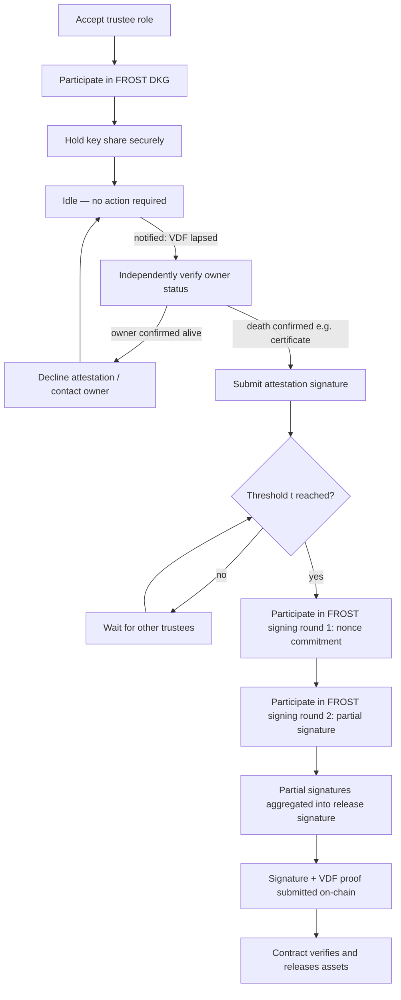

# User Journey Document
### Blockchain Crypto-Inheritance System — Owner & Trustee Flows

---

## 1. Overview

The system has two primary human actors:

- **Owner** — the person whose crypto assets are being protected and, eventually,
  inherited
- **Trustee** — one of a group of `n` people the owner selects, of which a
  threshold `t` must cooperate both to confirm death and to release assets

A third actor, the **beneficiary**, only appears at the very end of the flow
to receive assets, and is covered briefly in §4.

Both journeys are driven by the same two cryptographic components:
**FROST** (threshold key custody/signing) and the **VDF** (tamper-proof
inactivity timing), with a **trustee attestation** step bridging the two.

---

## 2. Owner Journey

### 2.1 Setup phase

1. **Select trustees.** Owner chooses `n` trustees (family, lawyer, close
   friends) and decides the threshold `t` (e.g., 3-of-5) — the minimum number
   who must cooperate for any signing or attestation action.
2. **Participate in FROST distributed key generation (DKG).** Owner's own
   client participates alongside trustees' clients in the DKG ceremony. At
   the end, the owner does **not** personally hold a usable single key — the
   signing authority is distributed entirely across the trustees' shares.
   *(Depending on the design, the owner may also hold one share, as one of
   the `n` participants — a decision worth stating explicitly in the report.)*
3. **Deploy the contract.** The resulting group public key, along with the
   chosen VDF parameters (`N`, `T`), is written into the smart contract.
4. **Assets stay in place.** No funds move into a custodial wallet — the
   contract only ever governs *release conditions*, not asset custody
   directly (unless the design requires moving assets into a
   contract-controlled address — confirm this against your final
   architecture).

### 2.2 Ongoing — normal life

5. **Periodic check-ins.** Owner submits a check-in transaction at whatever
   cadence the system defines (e.g., monthly). Each check-in:
   - Resets the VDF inactivity clock
   - Generates a fresh, unpredictable VDF input `x` for the next period
     (bound to the check-in transaction hash + block hash + nonce)
6. **No further action required** as long as check-ins continue. The owner's
   day-to-day use of their crypto assets is completely unaffected — this is
   a noncustodial, passive-by-default system from the owner's perspective.

### 2.3 Inactivity branch

7. **Owner misses a check-in** — intentionally (incapacitated, deceased) or
   unintentionally (travel, lost device, forgetfulness).
8. **VDF clock runs.** Nothing happens immediately; the system is designed to
   tolerate a single missed check-in within the delay window without
   escalating.
9. **If the owner returns before the VDF window lapses**, they simply check
   in again — the clock resets, no trustee action was ever triggered, no
   funds were ever at risk.
10. **If the window fully lapses**, the VDF proof is submitted on-chain
    (by anyone — owner's backup device, a trustee, or an unrelated party),
    and the system proceeds to trustee review. From this point on, **the
    owner is no longer the active party** — the journey continues from the
    trustee side (§3).

### 2.4 Outcome

- **False alarm:** owner returns at any point before trustees reach a
  threshold attestation of death — no release occurs, system resets to
  normal check-in state.
- **Confirmed death:** trustees reach threshold attestation, FROST release
  signature is produced and submitted, contract verifies both conditions,
  assets transfer to beneficiaries. The owner's journey ends here.

---

## 3. Trustee Journey

### 3.1 Onboarding

1. **Accept the trustee role.** Owner invites the trustee; trustee agrees to
   hold ongoing responsibility (this is a real-world, off-chain social
   agreement — not something the protocol itself enforces).
2. **Participate in FROST DKG.** Trustee runs the DKG protocol alongside the
   owner and other trustees, ending up with exactly one private key share.
   This share is generated locally and **never transmitted** to anyone else,
   including the owner or other trustees (see key-leakage discussion in
   project notes).
3. **Secure the key share.** Trustee stores their share securely — ideally
   in a hardware security module or secure enclave, not a plain file. This
   is the trustee's main ongoing security responsibility.

### 3.2 Idle period

4. **No action required** during normal operation. The trustee's client can
   remain mostly dormant — there is nothing to sign, attest, or check unless
   the owner's inactivity clock actually lapses.
5. Optionally, trustees may receive periodic confirmations that the owner is
   still checking in (a convenience notification, not a protocol
   requirement).

### 3.3 Triggered — VDF lapses

6. **Notification.** Trustee is notified (off-chain — email, app
   notification, or monitoring their own client) that the VDF inactivity
   condition has been met on-chain.
7. **Independent verification.** Trustee does their own real-world diligence
   — contacting the owner directly, checking with family, requesting a death
   certificate, etc. This is the human-judgment step the VDF cannot provide
   on its own.
8. **Decision point:**
   - If the owner is reachable/alive → trustee declines to attest, may
     contact the owner to prompt a check-in, and the system simply waits.
   - If death is genuinely confirmed → trustee proceeds to attest.

### 3.4 Attestation

9. **Submit attestation.** Trustee's client produces their portion of a
   threshold attestation signature (using the same FROST group) confirming
   death.
10. **Wait for threshold.** If fewer than `t` trustees have attested so far,
    this trustee's attestation is simply recorded/pending — nothing happens
    until enough trustees agree.
11. **Threshold reached.** Once `t` trustees have attested, the system is
    authorized to proceed to release signing.

### 3.5 Release signing (FROST)

12. **Round 1 — nonce commitment.** Each attesting trustee's client generates
    and broadcasts a public nonce commitment.
13. **Round 2 — partial signature.** Each trustee's client computes a partial
    signature using their private key share (which never leaves their
    device) and broadcasts it.
14. **Aggregation.** Partial signatures are combined into a single valid
    Schnorr signature over the release message — indistinguishable from a
    signature produced by one signer, and at no point does the full private
    key exist anywhere.
15. **Submission.** Any party (a trustee, a relayer script) submits the
    aggregated signature along with the VDF proof to the smart contract.

### 3.6 Outcome

- **Contract verifies both conditions** (VDF proof + Schnorr signature
  against the group public key) and releases assets to beneficiaries.
- **Trustee's role concludes** for this will, though their key share may
  still be relevant if the same trustee group protects other owners' wills
  in a multi-will deployment.

---

## 4. Beneficiary Journey (brief)

1. **Notified** (off-chain) that assets have been released, or monitors the
   relevant address/contract directly.
2. **Receives assets directly** at their designated address — no claim
   mechanism is required in this design, unlike systems such as Willchain,
   since release is a direct transfer triggered by the verified trustee
   signature rather than a beneficiary-initiated claim.
   *(If your final design instead requires beneficiaries to actively claim —
   e.g., via signature or ZK proof — this section should be expanded to
   mirror that flow.)*

---

## 5. Key Properties Across Both Journeys

| Property | Owner journey | Trustee journey |
|---|---|---|
| Normal-state effort | Periodic check-in only | None — fully idle |
| Triggering event | Missed check-in (passive) | VDF lapse notification (reactive) |
| Cryptographic role | DKG participant (optional signer) | DKG participant, attester, signer |
| False-positive recovery | Check in again — resets everything | Decline attestation, contact owner |
| Point of no return | Threshold trustee attestation reached | Submitting the final release signature |
| What they never do | Hold the full private key | See another trustee's key share |

---

## 6. Notes for the Report

- Both journeys are intentionally **low-friction in the common case** — owner
  just checks in, trustees stay idle — with cryptographic rigor only
  activating at the edge case (actual inactivity).
- The **trustee's real-world diligence step (§3.3)** is the part of the
  system that is *not* purely cryptographic — worth being explicit in the
  report that this is a deliberate design choice (human judgment gates
  release, not just machine-verifiable proofs), and discussing its
  limitations (trustees could still collude below the detection threshold,
  though not below the `t`-of-`n` cryptographic threshold).
