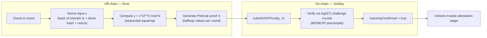

# VDF Structure Document
### Verifiable Delay Function Component — Blockchain Crypto-Inheritance System

---

## 1. Purpose

The VDF component is responsible for proving that a genuine, minimum amount of
real time has elapsed since the owner's last check-in — without relying on a
trusted clock, a centralized timer service, or an assumption that no one can
manipulate block timestamps. It forms the **inactivity-detection layer** of the
system, gating the trustee-attestation stage described elsewhere in the
project (see `areas/crypto-inheritance-system.md`).

A VDF alone does not prove death. It proves elapsed time. Its role is strictly
to prevent the inactivity timer from being gamed or fast-forwarded by any
party, including a colluding subset of trustees.

---

## 2. Core Primitive

A Verifiable Delay Function has three properties:

| Property | Meaning |
|---|---|
| **Sequentiality** | Computing the output requires *T* sequential steps; it cannot be meaningfully parallelized, even with large amounts of hardware. |
| **Fast verification** | Verifying a result takes far less time than computing it — ideally logarithmic in *T*. |
| **Uniqueness** | For a given input, there is exactly one valid output, so a prover cannot pre-compute multiple candidate answers and pick one later. |

**Construction used:** Pietrzak's VDF, based on repeated squaring in a group of
unknown order (an RSA group). Chosen over Wesolowski's construction because
Pietrzak's proof structure yields cheaper on-chain verification under the EVM
cost model, which is the deciding factor for a smart-contract deployment.

**Core relation:**

```
y = x^(2^T) mod N
```

Where:
- `x` — the input (bound to a specific check-in event, see §5)
- `T` — the number of sequential squarings (sets the minimum real-world delay)
- `N` — an RSA modulus of unknown factorization (the trusted setup parameter)
- `y` — the output, verified via an accompanying proof rather than recomputed

---

## 3. System Architecture

The component is split across two layers, mirroring the same off-chain /
on-chain division used for the FROST signing component.



### 3.1 Off-chain layer (Rust)

Responsible for the expensive, slow computation:
- Performs the `T` sequential squarings — intentionally non-parallelizable
- Generates the Pietrzak proof: a sequence of "halfway" intermediate values,
  one per halving round, that let a verifier check the work in ~log₂(T) steps
  instead of redoing all `T`
- Suggested libraries: `num-bigint` or `rug` (GMP bindings) for the
  big-integer modular exponentiation
- Runs as a standalone service, structurally parallel to the FROST signing
  service — triggered after each check-in, computes in the background,
  eventually produces `(y, π)`
- **Computation is permissionless**: no secret is required to compute a VDF.
  The owner's own backup machine, any trustee, or an unrelated third party can
  run this step — whoever finishes first submits the result on-chain.

### 3.2 On-chain layer (Solidity)

Responsible only for cheap verification:
- Runs the Fiat-Shamir challenge-response check, derived via `keccak256`
  hashing at each round
- Uses the `MODEXP` precompile (EIP-198) for all modular exponentiation —
  this is what makes big-integer math feasible in the EVM at all
- Terminates in a small number of rounds (~log₂(T)), ending in one trivial
  direct check once the remaining exponent is small enough
- **Submission is permissionless**: the verify function does not require
  `msg.sender` to be any specific party, since the proof is self-verifying

---

## 4. Verification Algorithm (per round)

Given claim "`x` squared `T` times equals `y`":

1. Prover supplies halfway point `μ = x_cur^(2^a)`, where the remaining
   exponent `T` is split into `a = floor(T/2)` and `b = T - a`
2. Contract derives challenge `r = H(x_cur, y_cur, μ, N) mod N` (Fiat-Shamir —
   prevents either party from choosing `r` favorably). Both the Rust prover and
   the Solidity verifier use `keccak256` over four 32-byte big-endian words.
3. Contract computes reduced claim:
   - `x' = x_cur^r · μ mod N`
   - `y' = μ^(r · 2^(b-a)) · y_cur mod N`
     (the extra factor of 2 applies only on uneven, i.e. odd-`T`, rounds)
4. Problem reduces to: "`x'` squared `b` times equals `y'`" — same claim
   type, roughly half the exponent
5. Repeat until the remaining exponent is 1, then check `x_cur^2 == y_cur`
   directly

```solidity
function verifyVDF(
    uint256 x, uint256 y, uint256[] calldata halfwayPoints,
    uint256 T, uint256 N
) public view returns (bool) {
    uint256 curX = x;
    uint256 curY = y;
    uint256 curT = T;
    uint256 idx = 0;

    while (curT > 1 && idx < halfwayPoints.length) {
        uint256 mu = halfwayPoints[idx];
        uint256 r = uint256(keccak256(abi.encodePacked(curX, curY, mu, N))) % N;

        uint256 a = curT / 2;
        uint256 b = curT - a;

        uint256 muR = modexp(mu, r, N);
        if (b != a) {
            muR = mulmod(muR, muR, N); // odd step: double the exponent
        }

        curX = mulmod(modexp(curX, r, N), mu, N);
        curY = mulmod(muR, curY, N);
        curT = b;
        idx++;
    }

    if (curT == 1) {
        return mulmod(curX, curX, N) == curY;
    }
    return modexp(curX, 2 ** curT, N) == curY;
}
```

The contract never performs all `T` squarings — only the challenge-reduction
steps above, each a cheap modular exponentiation.

---

## 5. Integration with the Check-In Mechanism

To prevent precomputation attacks, the VDF input `x` must not be predictable
before a check-in occurs:

```
x = H(checkin_tx_hash, block_hash, nonce)
```

Binding `x` to the check-in event this way ensures no one can compute the VDF
output *in advance* of the owner's next check-in, since the input doesn't
exist until the check-in happens. Each check-in therefore resets the clock
with a fresh, unpredictable input — not just a later deadline.

```solidity
function submitVDFProof(uint256[] calldata y, uint256[] calldata proof) external {
    require(block.number > lastCheckIn + requiredDelay, "too early");
    require(verifyVDF(currentChallenge, y, proof, T, N), "invalid proof");
    inactivityConfirmed = true;
}
```

Once `inactivityConfirmed` is set, the system moves to the trustee-attestation
stage — the VDF condition alone does **not** trigger asset release.

---

## 6. Security Assumptions & Trust Boundaries

| Component | Decentralization status | Notes |
|---|---|---|
| VDF computation | Fully decentralized / permissionless | No secret required; anyone can compute and submit |
| VDF verification | Fully decentralized / permissionless | Runs identically for any submitter |
| **RSA modulus `N`** | **Single point of trust (one-time setup)** | If factorization of `N` is known to any party, sequentiality is broken |

### Mitigating the modulus risk
- Use a published **"RSA UFO"** — a modulus constructed from numbers with
  unknown structure, specifically so no party knows its factors
- Or generate `N` via a **multi-party computation ceremony**, so no single
  participant ever learns the full factorization (comparable to zk-SNARK
  trusted-setup ceremonies)

This is the one place trust is concentrated in an otherwise fully
decentralized component, and should be stated explicitly as a limitation in
the project write-up rather than left implicit.

---

## 7. What the VDF Does and Does Not Prove

| Proves | Does not prove |
|---|---|
| A minimum real amount of time has passed since the last check-in | That the owner is actually dead |
| The elapsed-time claim cannot be forged or fast-forwarded by any party | That a missed check-in isn't travel, hospitalization, or device loss |
| The proof is valid regardless of who submitted it | Anything about identity, custody, or intent |

This is precisely why the system does not release assets on VDF confirmation
alone — it only unlocks the threshold trustee-attestation stage (FROST-based),
which supplies the human judgment component the VDF structurally cannot.

---

## 8. Open Design Parameters

- **Choice of `T`**: sets the minimum real-world delay (e.g., calibrated to a
  number of days/weeks); requires benchmarking actual squaring throughput on
  target hardware to calibrate accurately
- **Modulus size**: standard RSA security requires ≥2048-bit `N`; affects both
  prover cost and on-chain gas cost per `MODEXP` call
- **Re-keying `N`**: whether the modulus is fixed for the contract's lifetime
  or can be rotated, and under what authorization

## 9. Implementation Notes (Rust)

The Rust implementation (`rust/frost-service/src/vdf.rs`) provides:
- **`compute_vdf(x, params)`**: Core sequential computation `x^(2^t) mod n` using big integer modular exponentiation
- **`compute_vdf_with_proof(x, params)`**: Computes result and generates Pietrzak proof points (halfway values for each halving round)
- **`verify_vdf_pietrzak(x, y, proof, t, n)`**: Verifies proof via Fiat-Shamir challenge reduction over log₂(t) rounds
- **`generate_rsa_modulus(rng, bits)`**: Generates RSA modulus for testing

The CLI exposes this via `frost-service vdf [--t N] [--input HEX]` for computing proofs.
